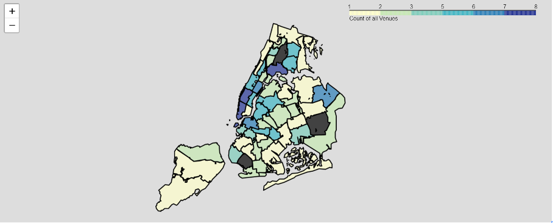
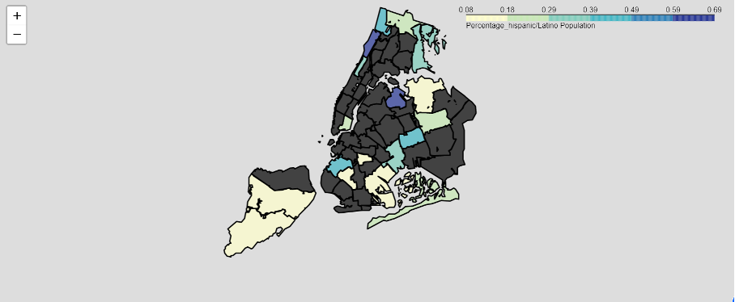
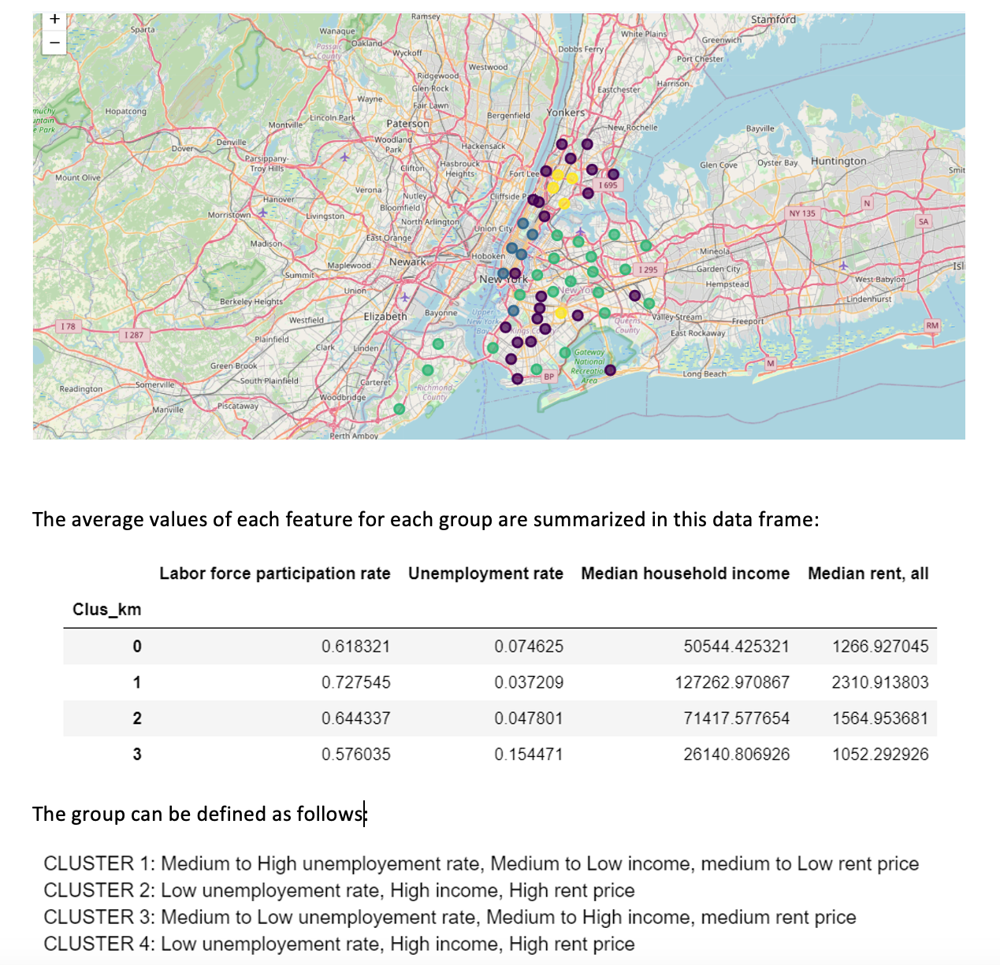

<a href="https://github.com/SederaRas/Optimal_Location_For_Zumba_Center_in_NYC.git" target="_blank">GitHub Repo</a>

<a href="https://github.com/SederaRas/Optimal_Location_For_Zumba_Center_in_NYC/blob/master/Battle_of_Neighborhoods_Presentation.pdf" target="_blank">Summary</a>

## **OVERVIEW** 
This project focuses on finding the optimal location for a stakeholder interested in opening a Zumba Fitness Club in New York City, United States.

The stakeholder requested that **three key conditions** be considered when selecting the location:

- **Avoid Saturation**: Identify neighborhoods that are not already crowded with fitness clubs or sports centers, with a particular emphasis on areas without an existing Zumba Fitness Club.
- **Demographic Targeting**: Prioritize neighborhoods with a high percentage of Hispanic residents, provided the first condition is satisfied.
- **Socio-Economic Considerations**: Focus on areas where the unemployment rate is acceptable, the average income is medium to high, and the average rent is reasonable.

## **DATA COLLECTON**
The data collection process for this project involved sourcing multiple public and external datasets. 
- *Neighborhood boundaries* were obtained from a geojson file from the Geodata library of the University of California. The Centroid of each neighbor was calculated using the Shapely library. 
- The Foursquare API was utilized to extract *relevant fitness venues*, including gyms, dance studios, yoga studios, and other fitness-related establishments. 
- *Demographic data* such as the percentage of the Hispanic population was sourced from the Infoshare website , 
- The *socio-economic data* covering unemployment rates, median household income, and rent prices were extracted from New York City's housing and
neighborhoods data hub, CoreData. 

These datasets were cleaned, processed, and integrated to facilitate the analysis and support decision-making.

The Neighborhood in this project was composed of 55 sub-boroughs within 5 boroughs.

## **DATA ANALYSIS**
#### Geospatial and statistical analysis
To narrow down potential neighborhoods for opening a Zumba center, the first step involved using a **Choropleth map** to identify areas that met the first two conditions.

***Choropleth map of venues saturation***
<!--  -->

***Choropleth map of the percentage of the Hispanic population***

#### Clustering analysis
**Clustering** techniques were applied to the results of the previous analysis to generate a list of the most promising neighborhoods based on the third condition. 

***Socio-Economic data Clusters***

## **OUTCOME**
The advantages of each area were outlined to assist in selecting the best possible location for the Zumba Fitness Club. The analysis yielded one potential neighborhood, **Jackson Heights**, meeting the specified criterias, enabling an informed decision on the final location.

#### **Skills Used**
- `Web Scraping`: Extracting relevant data from external sources.
- `Data Cleaning`: Preparing and cleaning data for analysis.
- `Data Analysis`: Analyzing demographic, socio-economic, and business saturation data.
- `Geospatial Analysis`: Using geographic information to assess neighborhood characteristics.
- `Clustering`: Applying clustering techniques to identify potential neighborhoods.
- `Visualization`: Presenting findings using graphs and maps.

#### **Tools Used** 
- `Python`: For data analysis and clustering (libraries like Pandas, NumPy, Scikit-Learn).
- `Jupyter Notebook`: For documenting the analysis and results.
- `Matplotlib / Seaborn`: For creating visualizations and plots.
- `Choropleth and Folium`: For interactive geospatial analysis and visualization.
- `Shapely`: For geometric operations.
- `Requests`: For making HTTP requests to gather data.
- `Foursquare API`: For gathering location-based data.